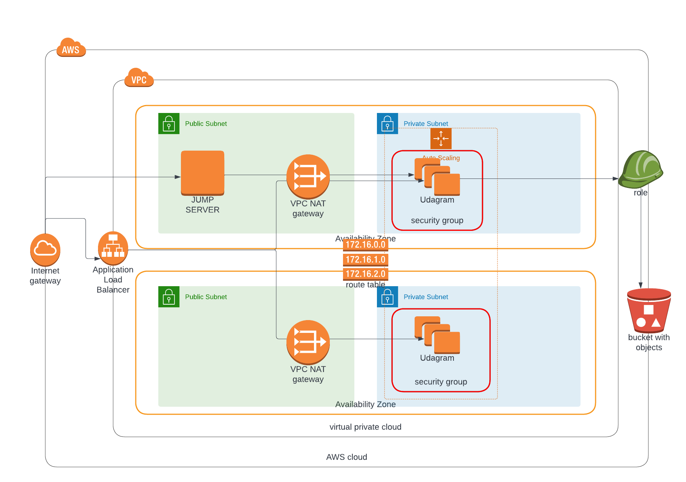

# Project Title - Deploy a high-availability web app using CloudFormation

## Project Architecture



## Setup

While the [Jump Server](https://en.wikipedia.org/wiki/Jump_server) is not required, you may need it to communicate with your EC2 instances which are in a private subnet and cannot be accessed outside your VPC. If you're using the Jump Server, uncomment the `KeyName` field in the `WebServerLaunchConfig` Resource in `server.yml`

- Clone this repository
- Create an `EC2ReadOnlyS3Access` service role and grant it the `AmazonS3ReadOnlyAccess` policy which will enable your EC2 instances communicate with your S3 Buckets
- Update the \*-params.json files with your preferred values
- Run the scripts in this order to create your infrastructure: `network`, `sg`, `server`

```
./create.sh your-network-stack-name network.yml network-params.json
./create.sh your-sg-stack-name sg.yml sg-params.json
./create.sh your-server-stack-name server.yml server-params.json
```

- You can run the `update.sh` the same way above if you've made any corrections after creating the stacks.
